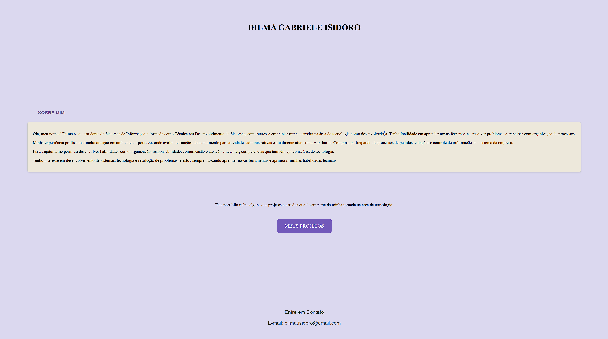

# 💻 Portfolio Website

Site de portfólio pessoal desenvolvido para apresentar minhas informações profissionais, trajetória acadêmica e projetos na área de tecnologia.

---

## 👩‍💻 Sobre Mim

Meu nome é **Dilma Gabriele Isidoro**, sou estudante de **Sistemas de Informação** e formada como **Técnica em Desenvolvimento de Sistemas**.

Tenho interesse em iniciar minha carreira na área de **desenvolvimento de sistemas**, buscando constantemente aprender novas ferramentas, desenvolver projetos e aprimorar minhas habilidades técnicas.

Minha experiência profissional inclui atuação em ambiente corporativo, onde desenvolvi habilidades importantes como organização, responsabilidade, comunicação e atenção a detalhes.

---

## 🎯 Objetivo do Projeto

Este site foi criado para compor meu **portfólio profissional**, reunindo informações sobre minha formação, experiência e projetos desenvolvidos durante minha jornada na área de tecnologia.

---

## 🛠 Tecnologias Utilizadas

- HTML
- CSS

---

## 📂 Estrutura do Projeto

```
portfolio-website
│
├── index.html
├── style.css
└── preview do Projeto
└── contato
```

---

## 📸 Preview do Projeto

Aqui você pode adicionar uma imagem do seu site.





## 📬 Contato

📧 Email: dilma.isidoro@email.com

---

⭐ Projeto desenvolvido como parte do meu aprendizado em **desenvolvimento web e tecnologia**.
